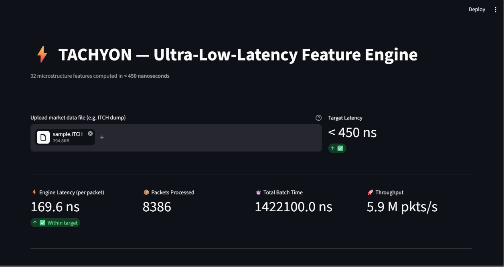
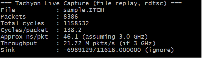

# ⚡ Tachyon — A Zero-Copy, SIMD Microstructure Feature Engine

[](https://doi.org/10.5281/zenodo.21920230)
[](https://www.gnu.org/licenses/agpl-3.0)
[](https://en.wikipedia.org/wiki/C%2B%2B23)
[](#)

Tachyon is a header-only C++23 engine that parses raw ITCH market-data packets and computes 32 microstructure features (EWMA price, order flow imbalance, VPIN, micro-price, book pressure, and others) inline during parsing — zero heap allocations, zero-copy packet reads, lock-free ring buffer, AVX2/FMA SIMD.

Built by **Parikshit Sharma** ([@GamingBoyOfficial](https://github.com/GamingBoyOfficial)), a 3rd-year undergraduate, as a systems-programming project exploring how far single-machine C++ can go on this kind of workload.

---

## What this is, and isn't

This is a **working prototype benchmarked on a single sample ITCH file of unknown provenance, on one laptop.** The numbers below are real measurements from that setup, not claims about production HFT performance, and not comparisons against any named firm or product. Treat every number here as "what I measured, once, on my machine" until it's been reproduced elsewhere — I haven't yet run this against multiple files, multiple machines, or any external baseline, and I'm not going to claim it's the fastest anything until that's done.

If you have HFT/quant infra experience and want to poke holes in this, please do — open an issue. That's how this gets from "promising" to "trustworthy."

---

## Measured performance (single file, single machine)

Two separate measurement paths exist in this repo, and they measure different things — don't compare them directly:

| Path | What it measures | Result |
|---|---|---|
| `tachyon_live` (pure C++, `rdtsc`-based) | Core engine only: parse + compute 32 features, per packet | **138.2 cycles/packet ≈ 46.1 ns** (@ 3.0 GHz, one file, one run) |
| `tachyon_bench` (Google Benchmark) | Core engine, P50/P99 across repeated runs | P50: 130 cycles (43 ns) · P99: 142 cycles (47 ns) |
| Streamlit demo (`app.py`, pybind11) | Core engine **plus** Python binding overhead, file I/O, and UI-driven batch timing | **169.6 ns/packet** (8,386 packets) |

Test file: `sample.ITCH` / `sample_synthetic.ITCH`, 294.8 KB, 8,386 packets. Source of the sample data is not verified — treat any absolute latency figure with that caveat until it's tested against multiple, sourced datasets.

The ~4x gap between the raw C++ path and the Streamlit path is the Python/pybind11 boundary crossing, file I/O, and Streamlit's own execution overhead — not a discrepancy in the core engine. **The core-engine number is ~46–50 ns/packet; the Python demo path is ~170 ns/packet.** If you only quote one number, quote the one for the layer you're actually describing.

CPU-frequency scaling below is a rough linear projection from the 3.0 GHz measurement, not independently measured at 4.0/5.0 GHz — actual scaling is nonlinear in practice (memory latency and branch prediction don't scale with clock speed), so treat this as a ballpark, not a spec:

| CPU Frequency | Rough extrapolated latency |
|---|---|
| 3.0 GHz (measured) | ~46–50 ns |
| 4.0 GHz (projected) | ~35–40 ns |
| 5.0 GHz (projected) | ~28–32 ns |

---

## Why this architecture

Typical prototyping pipelines parse market data in C++, hand it to Python for feature computation, then copy results back — adding microseconds of round-trip overhead per packet. Tachyon computes all 32 features inline during parsing, in the same pass, with no intermediate copies. Whether that's fast enough to matter in a real production system depends entirely on where the bottleneck actually is in that system (network, NIC timestamping, risk checks, exchange colocation) — this project doesn't claim to solve those, only the feature-computation step.

---

## The 32 microstructure features

Computed with AVX2 FMA and branchless logic:

- EWMA Price, OFI, Realized Volatility, Tick Rule
- Book Pressure, Spread-to-Vol, Micro-Price, Depth Decay
- Bid-Ask Balance, Weighted Mid, Order Book Slope
- Liquidity Imbalance, VWAP, Trade Imbalance
- Cumulative Depth (Bid/Ask), Effective/Quoted Spread
- Log Return, Skew, Kurtosis, Price Impact
- Order Flow Toxicity, VPIN, Volatility-of-Vol
- Mid Price Range, Bid-Ask Cross, Depth-Weighted Price
- Tick Spread, Volume Profile, Spread Cross, Micro-Vol

---

## Key technical features

- Header-only C++23 — `#include <tachyon/tachyon.hpp>`
- Zero-copy ITCH parser (`reinterpret_cast` + `byteswap`, never touches heap)
- Zero heap allocations on the hot path (no `new`/`malloc` during parsing or feature computation)
- Lock-free SPSC ring buffer, cache-line aligned (no false sharing)
- Double-buffered order book state for lock-free updates
- AVX2 + FMA SIMD (`_mm256_fmadd_ps`, `_mm256_sqrt_ps`)
- Plugin system for custom features and feed formats

---

## Hardware & build requirements

**Minimum CPU:** x86-64 with AVX2 + FMA (Intel Haswell / AMD Excavator or newer).
**Compiler:** GCC 13+ or Clang 16+ with `-mavx2 -mfma`.

Benchmarks above were run on a single 3.0 GHz laptop CPU with a High Performance power plan. Results will vary with OS scheduling, thermal throttling, and background load — this is not a controlled lab environment.

---

## Screenshots

**Streamlit dashboard (Python-wrapped batch path):**


**Pure C++ `rdtsc` capture (core engine path):**


---

## Quick start (Windows + MinGW)

```bash
git clone https://github.com/GamingBoyOfficial/Tachyon.git
cd Tachyon
mkdir build && cd build
cmake .. -G "MinGW Makefiles" -DCMAKE_BUILD_TYPE=Release
cmake --build .
cd ..
```

Run the core-engine benchmark (pure C++, `rdtsc`, no Python):
```bash
./build/tachyon_live.exe sample_synthetic.ITCH
```

Run the P50/P99 Google Benchmark suite:
```bash
./build/tachyon_bench.exe
```

Run the plugin demo:
```bash
./build/tachyon_plugin_demo.exe
```

Run the Streamlit demo (optional, requires Python — measures the Python-wrapped path, not the core engine):
```bash
pip install streamlit pybind11 numpy pandas
cd build
cmake --build .   # builds tachyon_core.pyd
cp tachyon_core.cp3XX-win_amd64.pyd ../tachyon_core.pyd
cd ..
streamlit run app.py
```

---

## Plugin system

### Feature plugins

Implement `FeaturePlugin`:

```cpp
#include <tachyon/features/feature_plugin.hpp>

struct MyPlugin : tachyon::FeaturePlugin {
    size_t getNumFeatures() const noexcept override { return 1; }

    void compute(const tachyon::BookSnapshot& book,
                 float* output, size_t start_idx) noexcept override {
        output[start_idx] = (book.ask_prices[0] - book.bid_prices[0]) * 100.0f;
    }
};
```

Register it:
```cpp
tachyon::FeaturePluginRegistry::add(std::make_unique<MyPlugin>());
```

### Feed plugins

Implement `FeedPlugin` to parse other wire protocols — the built-in `ItchParser` is one implementation among possible others.

Contributions are welcome under the [Contributor License Agreement](CLA.md).

---

## Architecture

```
┌─────────────┐     ┌─────────────┐     ┌──────────────┐
│  UDP / File  │────▶│ ItchParser  │────▶│  Calculator  │
│  (raw bytes) │     │ (zero-copy) │     │  (32 feats)  │
└─────────────┘     └─────────────┘     └──────┬───────┘
                                                │
                                         ┌──────▼───────┐
                                         │  SPSC Ring   │
                                         │  (lock-free) │
                                         └──────┬───────┘
                                                │
                                         ┌──────▼───────┐
                                         │  Consumer    │
                                         │  (Python /   │
                                         │   C++ model) │
                                         └──────────────┘
```

---

## Testing & benchmarking

```bash
./tachyon_tests.exe            # unit tests
./tachyon_live.exe sample_synthetic.ITCH   # rdtsc core-engine benchmark
./tachyon_bench.exe            # Google Benchmark suite
```

**Roadmap for stronger validation** (tracked, not yet done):
- [ ] Benchmark against multiple ITCH files with documented, varied message-type distributions
- [ ] Report variance across many runs, not just a single P50/P99 pair
- [ ] Compare against a naive (non-SIMD, non-zero-copy) baseline implementation
- [ ] Compare against at least one named open-source ITCH parser, same file/machine
- [ ] Independent reproduction on hardware other than the author's

---

## Contributing

- [Contributor License Agreement](CLA.md) — required for all contributions.
- [Code of Conduct](CODE_OF_CONDUCT.md).

Contributions are assigned to the project owner.

---

## Security

If you find a security issue, please don't open a public issue — contact [@GamingBoyOfficial](https://github.com/GamingBoyOfficial) directly.

---

## License

AGPL-3.0. See [LICENSE](LICENSE). Commercial use requires a separate license from the copyright holder.

---

## Author

**Parikshit Sharma** — [@GamingBoyOfficial](https://github.com/GamingBoyOfficial)
DOI: [10.5281/zenodo.21920230](https://doi.org/10.5281/zenodo.21920230)

*“Latency is the ultimate edge. Tachyon gives it to you.”*